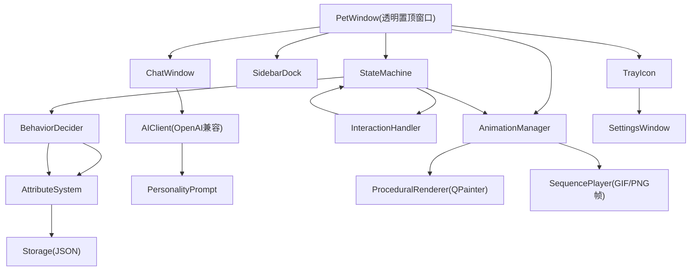

# Windows AI Desktop Pet

Feature Name: windows-desktop-pet
Updated: 2026-08-14

## Description

基于 Python + PySide6 的 Windows 桌面宠物应用。透明置顶宠物窗口常驻桌面，具备自主行为状态机、属性系统（能量/饥饿/清洁/心情）、多方式交互（单击/双击/拖拽/右键菜单）、OpenAI 兼容 API 对话、系统托盘管理、角色定制（程序绘制角色 + 用户素材导入 + ComfyUI 生成动画）以及 PyInstaller + NSIS 打包为 exe 安装程序的能力。

## Architecture



## Components and Interfaces

### 1. UI Layer (`ui/`)

- **PetWindow**: `QWidget`，`Qt.FramelessWindowHint | Qt.WindowStaysOnTopHint`，`WA_TranslucentBackground`。无边框透明置顶；事件区域仅覆盖宠物可视矩形，其余区域 `WA_TransparentForMouseEvents`。
  - 接口: `play_behavior(state)`, `move_to(x, y)`, `set_sidebar_mode(bool)`
- **ChatWindow**: 非置顶、普通对话框；支持多轮消息列表、输入框、发送按钮；可最小化。
- **SettingsWindow**: 表单包含 AI Base URL / API Key / Model / 角色切换 / 行为参数。
- **TrayIcon**: `QSystemTrayIcon`，菜单含显示/隐藏、切换角色、设置、退出。
- **ContextMenu**: 喂食、洗澡、玩耍、聊天、切换角色、设置、退出。

### 2. Core Layer (`core/`)

- **StateMachine**: 状态枚举 `Idle/Walk/Sleep/Drowsy/Play/Eat/Bath/Stroke/DoubleClick/Dirty/Hungry/Sad/Carried/SidebarIdle`。
  - 迁移规则: 用户操作事件优先打断当前状态；无事件时由 `BehaviorDecider` 决策。
- **BehaviorDecider**: 空闲超过 `idle_trigger_seconds` 后，综合属性值与随机权重选择行为；返回带持续时间的行为对象。
- **AttributeSystem**: 四属性 `Energy/Hunger/Clean/Mood`，值域 `[0, 100]`；每秒 tick 衰减，支持 `feed()/bath()/stroke()/play()` 反馈；持久化接口。
- **EventBus**: 简单发布订阅，UI 事件（点击/拖拽）与状态迁移解耦。

### 3. Animation Layer (`animation/`)

- **ProceduralRenderer**: 用 `QPainter` 程序绘制卡通角色（圆形身体、椭圆眼睛、腮红、口部表情），参数化（颜色、花纹、表情），支持按帧切换以模拟 `idle/walk/sleep/play` 等动作。无外部素材依赖，保证开箱即用。
- **SequencePlayer**: 播放角色包中的 GIF 或 PNG 序列帧，优先级高于程序绘制。
- **AnimationManager**: 统一入口，按角色包配置解析动作槽位（idle/walk/sleep/stroke/play/eat/bath/double_click/drowsy/hungry/dirty/sad），槽位缺失时回退到程序绘制或禁用对应功能。

### 4. AI Layer (`ai/`)

- **AIClient**: 基于 `requests` 的 OpenAI 兼容 `/v1/chat/completions` 客户端，配置 `base_url/api_key/model`。
- **PersonalityPrompt**: 根据角色包 `character.json` 的性格设定 + 当前属性状态生成 system prompt。
- **FallbackResponder**: 未配置 AI 时基于关键字模板回复，保证基础体验。

### 5. Data Layer (`data/`)

- **Storage**: JSON 文件存储（配置文件 `settings.json` + 状态数据 `state.json` + 对话历史 `chat_history.json`）。
- **Paths**: 优先级 `%APPDATA%/AIDesktopPet/`（已安装）与项目目录 `./data/`（源码运行），通过 `is_frozen` 判断。

### 6. ComfyUI 动画生成 (`comfyui/` + `scripts/`)

- **ComfyClient**: 提交 `/prompt` 工作流（POST 到 `127.0.0.1:8188`），轮询 `/history/{prompt_id}` 获取生成图片。
- **generate_motion.py**: 从角色参考图 + 动作描述生成动作序列，转 PNG 序列帧存入角色包。
- **import_character.py**: 将外部素材（GIF/PNG 序列/ComfyUI 产物）导入为完整角色包。

### 7. Build (`build/`)

- **build.bat**: PyInstaller 打包命令（`--noconsole --add-data`），产物为 `dist/AIDesktopPet/` 与单 exe。
- **installer.nsi**: NSIS 脚本生成安装程序 `AIDesktopPet-Setup.exe`。
- **github workflows**: `.github/workflows/build-windows.yml` 在 Windows runner 上自动打包并上传产物。

## Data Models

```json
{
  "settings": {
    "character": "slime_chan",
    "ai": {"base_url": "", "api_key": "", "model": ""},
    "behavior": {"idle_trigger_seconds": 30, "walk_range": 120}
  },
  "state": {
    "attributes": {"energy": 80, "hunger": 20, "clean": 90, "mood": 70},
    "last_saved": "2026-08-14T10:00:00"
  },
  "character.json": {
    "id": "slime_chan",
    "label": "史莱姆酱",
    "personality": "可爱、元气",
    "animations": {
      "idle": {"type": "procedural", "params": {"colors": ["#ff6b9d", "#ff8fab"]}},
      "walk": {"type": "sequence", "frames_dir": "walk", "fps": 10}
    }
  }
}
```

## Correctness Properties

1. 任意时刻状态机处于且仅处于一个有效状态。
2. 属性值恒在 `[0, 100]` 区间内，tick 更新后强制 clamp。
3. 用户交互事件优先级高于自主行为事件，交互期间不触发自主行为。
4. 侧边栏模式下宠物窗口不与任务栏重叠，吸附判定距离阈值为 40px。
5. AI 请求失败或未配置时必定回退到 FallbackResponder，不抛异常到 UI。
6. 退出流程先持久化属性与对话历史，再销毁窗口与托盘。

## Error Handling

| 场景 | 处理策略 |
|------|----------|
| AI API 请求超时/网络错误 | 捕获异常，FallbackResponder 回复，提示配置检查 |
| 角色包动画槽位缺失 | 回退程序绘制或禁用该功能，不中断运行 |
| 数据文件损坏/版本不兼容 | 备份损坏文件为 `.bak`，用默认值重建 |
| ComfyUI 不可用 | 提示用户启动本地 ComfyUI，导入流程不阻塞其他功能 |
| 打包后素材路径错误 | 使用 `sys._MEIPASS` 定位 assets，路径函数统一封装 |

## Test Strategy

1. **单元测试 (pytest)**:
   - `test_state_machine.py`: 状态迁移合法性与事件优先级
   - `test_attributes.py`: 属性 tick 衰减、clamp、持久化往返
   - `test_behavior.py`: 行为决策触发条件与概率分布
   - `test_ai_client.py`: mock 请求验证 payload 与错误回退
   - `test_storage.py`: 读写、损坏恢复
2. **冒烟测试**: 无头环境用 `QT_QPA_PLATFORM=offscreen` 实例化各窗口组件验证不崩溃。
3. **手动验证清单**（Windows）: 拖拽吸附、自主行为触发、属性变化、AI 对话、角色切换、托盘、打包安装运行。

## References

[^1]: (Website) - [ai-desktop-pet 参考项目](https://github.com/waterthree3/ai-desktop-pet)
